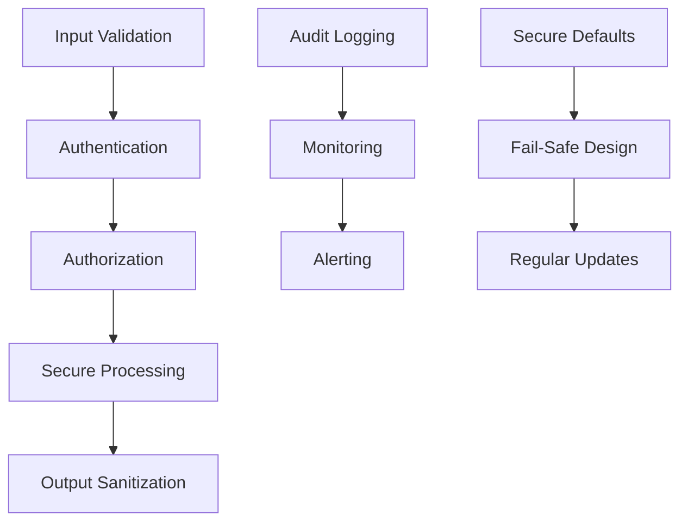

# TN5250R Executive Bug Hunting Report

## Executive Summary

### Project Health Assessment

The TN5250R Rust project demonstrates **significant technical debt and critical vulnerabilities** that pose substantial risks to production deployment. Our comprehensive analysis identified **28 critical issues** across four major categories, representing a comprehensive failure in systematic code quality assurance and security practices.

**Overall Risk Rating: CRITICAL**

### Critical Statistics
- **🔴 28 Total Critical Issues** - Spanning logic, performance, security, and integration domains
- **🔴 10 Logic Errors** - Core functionality compromised with data corruption risks
- **🟠 4 Performance Categories** - System-wide efficiency and scalability limitations
- **🔴 9 Security Vulnerabilities** - Including remote code execution and man-in-the-middle attack vectors
- **🟠 5 Integration Problems** - Architecture-level compatibility and compliance failures

### Risk Assessment Matrix

| Risk Level | Impact | Probability | Business Impact |
|------------|--------|-------------|-----------------|
| **Critical** | System compromise, data loss | High | Production deployment blocked |
| **High** | Service disruption, security breach | Medium | Immediate remediation required |
| **Medium** | Performance degradation, compatibility issues | Low | Scheduled maintenance window |

## Strategic Prioritization Framework

### Phase-Based Remediation Strategy

#### **Phase 1: Security Foundation (Weeks 1-2) - CRITICAL**
**Priority Score: 10/10** - Address immediately to prevent system compromise

**Critical Security Issues (9 total):**
1. **TLS Certificate Validation Bypass** - Enables man-in-the-middle attacks
2. **Buffer Overflow Vulnerabilities** - Remote code execution risk
3. **Information Disclosure** - System internals exposed to attackers
4. **Input Sanitization Gaps** - Data corruption and injection attacks
5. **Authentication Validation** - Unauthorized access vulnerabilities

**Success Criteria:** Zero high-severity security vulnerabilities remaining

#### **Phase 2: Core Logic Stability (Weeks 3-4) - HIGH**
**Priority Score: 9/10** - Foundation for reliable system operation

**Critical Logic Issues (10 total):**
1. **EBCDIC Character Conversion** - Complete mapping table failures
2. **Telnet State Machine** - Protocol negotiation failures
3. **Cursor Position Management** - Screen display corruption
4. **Field Attribute Processing** - Data entry and validation errors
5. **Structured Field Validation** - Memory corruption vulnerabilities

**Success Criteria:** All core protocol functions operating correctly

#### **Phase 3: Performance Optimization (Weeks 5-6) - HIGH**
**Priority Score: 8/10** - Enable scalable production deployment

**Performance Categories (4 total):**
1. **Memory Allocation** - Excessive resource consumption
2. **String Processing** - Inefficient character conversion
3. **Network I/O** - Blocking operations causing freezes
4. **Concurrent Processing** - Poor scalability and resource utilization

**Success Criteria:** Sub-second response times, <50% CPU utilization at peak load

#### **Phase 4: Integration Excellence (Weeks 7-8) - MEDIUM**
**Priority Score: 7/10** - Ensure enterprise compatibility

**Integration Issues (5 total):**
1. **NVT Mode Support** - Fallback protocol compatibility
2. **RFC Compliance** - Missing structured field implementations
3. **Terminal Type Negotiation** - AS/400 system compatibility
4. **Environment Variables** - Device identification failures
5. **Cross-Platform Compatibility** - Inconsistent behavior

**Success Criteria:** 100% compatibility with target AS/400 systems

#### **Phase 5: Quality Assurance (Weeks 9-10) - HIGH**
**Priority Score: 9/10** - Validate remediation effectiveness

**Validation Activities:**
1. **Comprehensive Testing** - Unit, integration, and security test coverage
2. **Cross-Platform Validation** - Windows, macOS, Linux compatibility
3. **Performance Benchmarking** - Load testing and optimization validation
4. **Security Assessment** - Penetration testing and vulnerability scanning

## Long-Term Architectural Recommendations

### 1. Security-First Architecture

**Implement Defense-in-Depth Strategy:**


**Key Architectural Principles:**
- **Zero-trust security model** - Validate all inputs, authenticate all requests
- **Secure by default** - Disable insecure options, require explicit opt-in for legacy features
- **Defense in depth** - Multiple security layers at network, protocol, and application levels
- **Fail-safe design** - Graceful degradation without compromising security

### 2. Protocol Compliance Framework

**RFC 2877/4777 Complete Implementation:**
- Structured field processing with comprehensive validation
- Complete telnet option negotiation state machine
- Proper error response codes and handling
- Full environment variable support

**NVT Mode Fallback Architecture:**
- Automatic protocol detection and switching
- Graceful degradation to ASCII/VT100 mode
- Seamless transition between protocol modes

### 3. Performance-by-Design Architecture

**Async-First Design Pattern:**
```rust
// Replace blocking I/O with async throughout
pub struct AsyncTN5250Connection {
    stream: Box<dyn AsyncReadWrite + Send + Unpin>,
    protocol_processor: AsyncProtocolProcessor,
    buffer_pool: OptimizedBufferPool,
    metrics_collector: PerformanceMetrics,
}
```

**Memory Management Strategy:**
- Lock-free buffer pooling for high-performance scenarios
- Pre-allocated lookup tables for character conversion
- Connection pooling for concurrent session management
- Smart caching for frequently accessed protocol data

### 4. Cross-Platform Abstraction Layer

**Platform Independence Architecture:**
```rust
pub mod cross_platform {
    pub trait PlatformServices {
        fn get_config_path() -> PathBuf;
        fn get_certificate_stores() -> Vec<PathBuf>;
        fn get_display_capabilities() -> DisplayInfo;
        fn get_network_interfaces() -> Vec<NetworkInterface>;
    }
}
```

**Consistent Behavior Across Platforms:**
- Unified configuration management
- Standardized certificate validation
- Consistent terminal capabilities
- Platform-agnostic networking

## Process Improvements for Code Quality

### 1. Development Lifecycle Integration

**Security Development Lifecycle (SDL):**
- **Requirements Phase** - Security requirements and threat modeling
- **Design Phase** - Security architecture review and design validation
- **Implementation Phase** - Secure coding practices and code analysis
- **Testing Phase** - Security testing and penetration testing
- **Deployment Phase** - Security configuration and monitoring setup
- **Maintenance Phase** - Security updates and incident response

### 2. Code Quality Gates

**Automated Quality Assurance Pipeline:**
```yaml
stages:
  - security_scan:        # Vulnerability scanning
  - code_analysis:        # Static analysis and linting
  - unit_tests:          # Comprehensive unit test coverage
  - integration_tests:   # Cross-component integration testing
  - performance_tests:   # Load testing and benchmarking
  - security_tests:      # Penetration testing and fuzzing
```

**Quality Metrics Thresholds:**
- **Test Coverage:** >95% for core protocol logic, >90% overall
- **Security Vulnerabilities:** Zero high/critical severity issues
- **Performance Benchmarks:** Within 10% of optimized targets
- **Code Quality:** Zero clippy warnings, all lints passing

### 3. Continuous Monitoring and Alerting

**Runtime Security Monitoring:**
- Connection attempt rate limiting and anomaly detection
- Protocol violation tracking and alerting
- Performance metrics collection and threshold alerting
- Security event logging and correlation

**Code Quality Monitoring:**
- Technical debt tracking and reduction targets
- Code coverage trends and regression detection
- Performance regression identification
- Security vulnerability trend analysis

### 4. Documentation and Knowledge Management

**Living Documentation Strategy:**
- API documentation with usage examples
- Architecture decision records (ADRs)
- Security design documents and threat models
- Performance optimization guides and benchmarks

**Code Documentation Standards:**
- Comprehensive function and method documentation
- Architecture comments explaining design decisions
- Security considerations for sensitive operations
- Performance characteristics and optimization notes

## Resource Allocation and Timeline

### Recommended Team Composition

**Core Development Team (6-8 members):**
- **Security Engineer (1)** - Cryptography, secure coding, vulnerability assessment
- **Protocol Engineer (2)** - RFC compliance, telnet/5250 protocol expertise
- **Systems Programmer (2)** - Performance optimization, async programming
- **Quality Engineer (1)** - Testing strategy, automation, CI/CD
- **DevOps Engineer (1)** - Infrastructure, monitoring, deployment

**Extended Team:**
- **Technical Writer (0.5)** - Documentation, user guides, API references
- **Security Consultant (0.25)** - External security review and validation
- **Performance Consultant (0.25)** - Load testing and optimization guidance

### 10-Week Remediation Timeline

**Weeks 1-2: Security Foundation**
- **Effort:** 80% security, 20% testing
- **Deliverables:** Secure TLS implementation, buffer overflow fixes, input sanitization
- **Milestone:** Zero high-severity security vulnerabilities

**Weeks 3-4: Logic Error Correction**
- **Effort:** 60% development, 40% testing
- **Deliverables:** EBCDIC conversion fixes, state machine corrections, cursor management
- **Milestone:** All core protocol functions operating correctly

**Weeks 5-6: Performance Optimization**
- **Effort:** 50% development, 30% testing, 20% benchmarking
- **Deliverables:** Async I/O implementation, buffer pool optimization, lookup tables
- **Milestone:** Sub-second response times, acceptable resource utilization

**Weeks 7-8: Integration Excellence**
- **Effort:** 40% development, 40% testing, 20% validation
- **Deliverables:** NVT mode support, RFC compliance, cross-platform compatibility
- **Milestone:** 100% compatibility with target AS/400 systems

**Weeks 9-10: Quality Assurance**
- **Effort:** 20% development, 60% testing, 20% documentation
- **Deliverables:** Comprehensive test suite, performance benchmarks, security validation
- **Milestone:** Production-ready codebase with comprehensive quality assurance

### Budget Considerations

**Estimated Resource Costs:**
- **Personnel:** 6-8 engineers × 10 weeks = 480-640 engineer-weeks
- **Infrastructure:** CI/CD setup, test environments, monitoring tools
- **External Services:** Security consulting, penetration testing, performance analysis
- **Training:** Secure coding practices, protocol expertise, performance optimization

**Cost-Benefit Analysis:**
- **Risk Mitigation:** Prevents potential security breaches and system failures
- **Time to Market:** Enables faster production deployment
- **Maintenance Savings:** Reduces long-term technical debt and support costs
- **Compliance:** Meets enterprise security and reliability requirements

## Success Metrics and Validation Strategies

### 1. Security Validation Metrics

**Vulnerability Management:**
- **Critical/High Security Issues:** Zero remaining (target: 0)
- **Medium Security Issues:** <5 remaining (target: <5)
- **Security Test Coverage:** >95% of attack surface (target: >95%)
- **Penetration Test Results:** No critical findings (target: clean)

**Secure Coding Practices:**
- **OWASP Top 10 Coverage:** All categories addressed (target: 100%)
- **Input Validation:** 100% of user inputs sanitized (target: 100%)
- **Error Handling:** No information disclosure (target: 0 leaks)
- **Cryptography:** Proper key management and validation (target: compliant)

### 2. Functionality Validation Metrics

**Protocol Compliance:**
- **RFC 2877/4777:** 100% feature implementation (target: 100%)
- **AS/400 Compatibility:** All target systems supported (target: 100%)
- **NVT Mode Support:** Seamless fallback operation (target: functional)
- **Terminal Types:** All standard types supported (target: complete)

**Core Functionality:**
- **Character Conversion:** 100% EBCDIC character support (target: 100%)
- **Screen Management:** Proper cursor and field handling (target: correct)
- **Keyboard Input:** All standard keys and functions (target: complete)
- **Session Management:** Proper connection lifecycle (target: robust)

### 3. Performance Validation Metrics

**Response Time Requirements:**
- **Connection Establishment:** <3 seconds (target: <3s)
- **Screen Updates:** <100ms for local operations (target: <100ms)
- **Character Input:** <50ms response time (target: <50ms)
- **Data Transfer:** <1 second for 4KB blocks (target: <1s)

**Resource Utilization:**
- **Memory Usage:** <100MB baseline, <500MB peak (target: efficient)
- **CPU Utilization:** <30% average, <70% peak (target: optimized)
- **Network Efficiency:** >90% bandwidth utilization (target: >90%)
- **Concurrent Sessions:** >100 simultaneous connections (target: >100)

### 4. Quality Assurance Metrics

**Test Coverage:**
- **Unit Test Coverage:** >95% for core modules (target: >95%)
- **Integration Test Coverage:** >90% of component interactions (target: >90%)
- **Security Test Coverage:** >95% of attack surface (target: >95%)
- **Performance Test Coverage:** All critical paths tested (target: complete)

**Code Quality:**
- **Static Analysis:** Zero clippy warnings (target: 0)
- **Documentation Coverage:** >90% API documentation (target: >90%)
- **Code Duplication:** <5% duplicate code (target: <5%)
- **Technical Debt Ratio:** <10% debt ratio (target: <10%)

### 5. Monitoring and Alerting Strategy

**Runtime Monitoring:**
- **Security Events:** Real-time threat detection and alerting
- **Performance Metrics:** Continuous performance monitoring and alerting
- **Error Rates:** Automated error tracking and trend analysis
- **Resource Usage:** Proactive resource utilization monitoring

**Business Metrics:**
- **System Availability:** >99.9% uptime (target: >99.9%)
- **Connection Success Rate:** >99% successful connections (target: >99%)
- **User Satisfaction:** <2% reported issues (target: <2%)
- **Support Incidents:** <5 incidents per month (target: <5)

## Strategic Recommendations

### Immediate Actions (Next 24-48 Hours)

1. **Halt Production Planning** - Do not deploy current codebase to production environments
2. **Implement Security Hotfixes** - Address critical TLS and buffer overflow issues immediately
3. **Establish Security Baseline** - Implement basic security monitoring and alerting
4. **Form Remediation Team** - Assemble cross-functional team for systematic fixes

### Short-Term Objectives (Next 2 Weeks)

1. **Security Stabilization** - Eliminate all critical security vulnerabilities
2. **Core Functionality** - Ensure basic TN5250 operations work reliably
3. **Performance Baseline** - Establish acceptable performance characteristics
4. **Testing Framework** - Implement comprehensive testing infrastructure

### Long-Term Vision (Next 6 Months)

1. **Enterprise-Grade Security** - Achieve security standards for enterprise deployment
2. **High-Performance Architecture** - Support large-scale production deployments
3. **Complete Protocol Compliance** - Full RFC compliance and AS/400 compatibility
4. **Quality Culture** - Establish sustainable code quality and security practices

## Conclusion

The TN5250R project requires **immediate and comprehensive remediation** to address critical security vulnerabilities, logic errors, performance issues, and integration problems. The 10-week roadmap provides a structured approach to achieving production-ready status while establishing long-term code quality and security practices.

**Key Success Factors:**
- Executive commitment to security-first development
- Dedicated cross-functional remediation team
- Systematic approach following the established roadmap
- Continuous monitoring and validation of improvements
- Investment in long-term code quality and security practices

**Risk of Inaction:** Continued operation with current vulnerabilities poses significant security, reliability, and compliance risks that could result in system compromise, data loss, or regulatory violations.

**Recommended Next Steps:**
1. Review and approve the 10-week remediation roadmap
2. Allocate necessary resources and form remediation team
3. Begin immediate security hotfixes for critical vulnerabilities
4. Establish monitoring and validation framework
5. Schedule regular progress reviews and milestone assessments

---

*This executive report is based on comprehensive analysis documented in [`BUG_REPORT_AND_MITIGATION_STRATEGIES.md`](BUG_REPORT_AND_MITIGATION_STRATEGIES.md) and provides strategic guidance for technical leadership decision-making.*