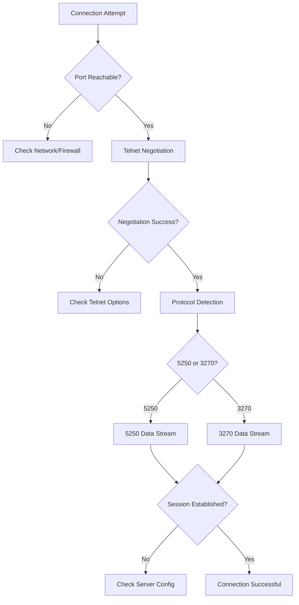
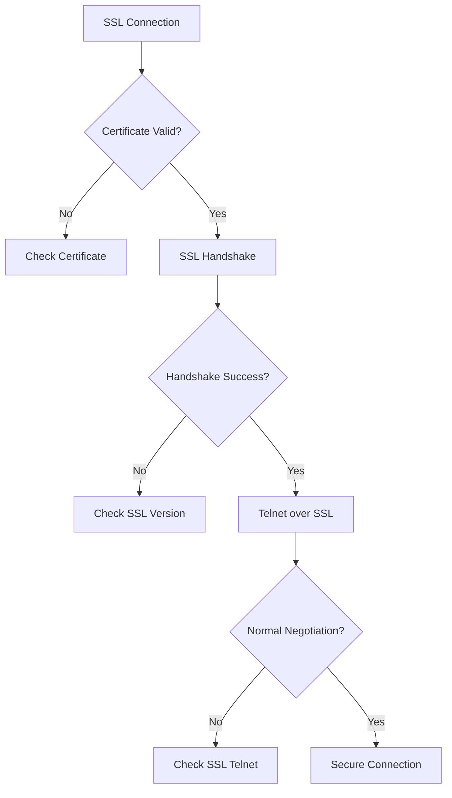
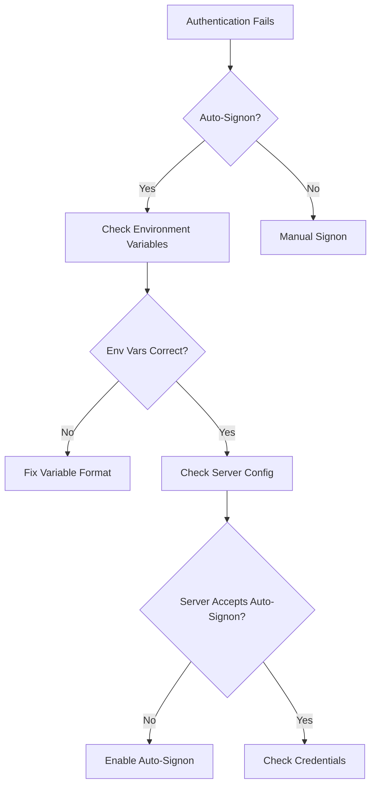

# TN5250/TN3270 Comprehensive Troubleshooting Guide

## Overview

This guide provides comprehensive troubleshooting procedures for TN5250 (AS/400) and TN3270 (Mainframe) terminal emulation issues. This document covers diagnostic commands, common failure points, environment-specific differences, and resolution procedures.

## Table of Contents

1. [Diagnostic Commands Reference](#diagnostic-commands-reference)
2. [Common Failure Points](#common-failure-points)
3. [Environment-Specific Analysis](#environment-specific-analysis)
4. [Client-Side Configuration Issues](#client-side-configuration-issues)
5. [Server-Side Configuration](#server-side-configuration)
6. [Troubleshooting Workflows](#troubleshooting-workflows)

## Diagnostic Commands Reference

### Basic Connectivity Testing

#### Telnet Commands

**Basic Telnet Connection Test:**
```bash
telnet as400.example.com 23
```
- Tests raw TCP connectivity to port 23
- Should receive telnet negotiation options from server
- Look for: `IAC WILL TERMINAL-TYPE`, `IAC DO END-OF-RECORD`, `IAC DO BINARY`

**Telnet with Debug Output:**
```bash
telnet -d as400.example.com 23
```
- Shows telnet option negotiation details
- Displays server capabilities and responses
- Essential for diagnosing negotiation failures

**Telnet to SSL Port:**
```bash
telnet as400.example.com 992
```
- Tests connectivity to SSL/TLS port
- Should show SSL handshake if server supports it

#### Nmap Commands

**Port Scanning and Service Detection:**
```bash
# Scan common TN5250/TN3270 ports
nmap -p 23,992,9921 as400.example.com

# Service version detection
nmap -sV -p 23,992 as400.example.com

# Operating system detection
nmap -O as400.example.com
```

**Advanced Port Analysis:**
```bash
# Check if ports are actually listening
nmap -sT --reason as400.example.com

# Test port responsiveness
nmap --host-timeout 10s -p 23 as400.example.com
```

#### Tcpdump Commands

**Basic Packet Capture:**
```bash
# Capture all traffic to/from target host
sudo tcpdump -i any host as400.example.com -w tn5250_capture.pcap

# Capture only telnet traffic
sudo tcpdump -i any port 23 -w telnet_traffic.pcap

# Real-time telnet packet display
sudo tcpdump -i any port 23 -A -s 0
```

**Protocol-Specific Filters:**
```bash
# Capture TN5250 negotiation packets
sudo tcpdump -i any -X 'tcp port 23 and (tcp[13] = 0x17 or tcp[13] = 0x19)'

# Capture SSL/TLS handshake
sudo tcpdump -i any port 992 -w ssl_handshake.pcap
```

#### Wireshark Filters

**Telnet Negotiation Analysis:**
```
# Show all telnet commands
telnet

# Filter TN5250 specific options
telnet.option == 24 or telnet.option == 39 or telnet.option == 42

# Show terminal type negotiation
telnet.suboption == 24

# Display environment variables
telnet.suboption == 39
```

**5250 Protocol Filters:**
```
# Show 5250 data streams (after telnet)
frame contains 04:11 or frame contains 04:42

# Filter by 5250 command types
tn5250.cmd == 11 or tn5250.cmd == 42 or tn5250.cmd == 50
```

#### Netcat Commands

**Raw Protocol Testing:**
```bash
# Connect and send raw data
nc as400.example.com 23

# Test SSL connection
nc -v as400.example.com 992

# Send specific telnet commands
echo -e '\xff\xfb\x18' | nc as400.example.com 23  # IAC WILL TERMINAL-TYPE
```

**Protocol Simulation:**
```bash
# Simulate basic TN5250 client
nc as400.example.com 23 << EOF
\xff\xfb\x18\xff\xfd\x19\xff\xfd\x03\xff\xfe\x00\xff\xfb\x01
EOF
```

## Common Failure Points

### LU Name Configuration Issues

**Problem:** Logical Unit (LU) name mismatches or invalid LU names

**Symptoms:**
- Connection rejected immediately after negotiation
- "LU not available" errors
- Session establishment fails

**Diagnostic Steps:**
1. Check configured LU name format
2. Verify LU name length (should be 1-10 characters)
3. Confirm LU name is not already in use

**Resolution:**
```bash
# Test with different LU names
telnet -E as400.example.com 23

# Check AS/400 LU configuration
WRKCFGSTS *DEV *TELNET
```

### Session Timeout Problems

**Problem:** Sessions disconnect after idle periods

**Symptoms:**
- Unexpected disconnections during use
- "Session timed out" messages
- Inactivity timeouts

**Diagnostic Steps:**
1. Check server timeout settings
2. Verify client keepalive settings
3. Monitor for network interruptions

**Resolution:**
```bash
# Test with keepalive
telnet -K as400.example.com 23

# Check server timeout configuration
CHGTELNA TIMEOUT(3600)
```

### Character Encoding Mismatches (ASCII/EBCDIC)

**Problem:** Incorrect character translation between client and server

**Symptoms:**
- Garbled text display
- Incorrect special characters
- Data entry issues

**Diagnostic Steps:**
1. Verify character set negotiation
2. Check terminal type settings
3. Test with different encoding options

**Resolution:**
```bash
# Force specific character set
export LANG=C
telnet as400.example.com 23

# Check EBCDIC conversion
echo "Test message" | iconv -f ASCII -t EBCDIC
```

### Terminal Type Negotiation Failures

**Problem:** Server rejects or doesn't recognize terminal type

**Symptoms:**
- Terminal type subnegotiation fails
- Server responds with unknown terminal type
- Display formatting issues

**Diagnostic Steps:**
1. Monitor telnet negotiation sequence
2. Check supported terminal types on server
3. Verify terminal type string format

**Resolution:**
```bash
# Test with standard terminal type
TERM=IBM-5250 telnet as400.example.com 23

# Check server terminal type support
DSPDEVDSP DEV(*TELNET)
```

### Environment Variable Validation Errors

**Problem:** Auto-signon environment variables rejected

**Symptoms:**
- Authentication fails despite correct credentials
- Environment variable negotiation errors
- Signon screen appears instead of auto-signon

**Diagnostic Steps:**
1. Verify environment variable format
2. Check variable name/value encoding
3. Confirm server accepts environment variables

**Resolution:**
```bash
# Test environment variable format
export DEVNAME=TN5250R
export USER=myuser
telnet as400.example.com 23
```

### SSL/TLS Certificate Problems

**Problem:** Certificate validation failures

**Symptoms:**
- SSL handshake fails
- Certificate verification errors
- "Untrusted certificate" messages

**Diagnostic Steps:**
1. Check certificate validity dates
2. Verify certificate chain
3. Confirm certificate hostname matching

**Resolution:**
```bash
# Test SSL connection
openssl s_client -connect as400.example.com:992

# Check certificate details
openssl x509 -in certificate.pem -text -noout
```

## Environment-Specific Analysis

### AS/400 (TN5250) vs Mainframe (TN3270) Differences

| Aspect | TN5250 (AS/400) | TN3270 (Mainframe) |
|--------|-----------------|-------------------|
| **Default Port** | 23 | 23 |
| **SSL Port** | 992 | 993 |
| **Protocol** | RFC 2877/4777 | RFC 2355 |
| **Terminal Types** | IBM-5250, IBM-3179-2 | IBM-3278, IBM-3279 |
| **Screen Sizes** | 24x80, 27x132 | 24x80, 32x80, 43x80 |
| **Data Stream** | 5250 protocol | 3270 protocol |
| **EBCDIC Support** | Required | Required |
| **Field Attributes** | 5250 field format | 3270 field format |

### Port Usage Patterns

**Standard Ports:**
- Port 23: Standard telnet (both TN5250 and TN3270)
- Port 992: SSL/TLS telnet (TN5250)
- Port 993: SSL/TLS telnet (TN3270)

**Non-Standard Ports:**
- Port 8470: IBM default for some systems
- Port 9921: Alternative SSL port
- Port 2323: Custom telnet configurations

### Security Configuration Variations

**AS/400 Security:**
```bash
# Check telnet security settings
WRKTELNA
CHGTELNA ALWSVRSEC(*YES)
CHGTELNA ALWSSL(*YES)
```

**Mainframe Security:**
```bash
# RACF configuration for TN3270
RDEFINE SERVAUTH EZB.PORTACCESS.as400.example.com.TN3270 UACC(NONE)
PERMIT EZB.PORTACCESS.as400.example.com.TN3270 CLASS(SERVAUTH) ID(userid) ACCESS(READ)
```

### Protocol Behavior Differences

**TN5250 Characteristics:**
- Uses 5250 data stream after telnet negotiation
- Supports device names and LU pools
- Enhanced features like GUI support
- Structured field support for advanced features

**TN3270 Characteristics:**
- Uses 3270 data stream after telnet negotiation
- Supports screen sizes up to 43x80
- Color and extended attribute support
- Different field attribute handling

## Client-Side Configuration Issues

### Terminal Emulation Settings

**Problem:** Incorrect terminal emulation configuration

**Common Issues:**
- Wrong screen size selection
- Incorrect terminal type
- Display attribute mismatches

**Resolution Steps:**
1. Verify server-supported screen sizes
2. Check terminal type compatibility
3. Test with standard 24x80 configuration first

### Keyboard Mapping Problems

**Problem:** Keyboard input not properly translated

**Symptoms:**
- Function keys not working
- Special characters incorrect
- AID key mapping issues

**Diagnostic Commands:**
```bash
# Test keyboard input
xmodmap -pke | grep F1
# Check for proper function key mapping
```

**Resolution:**
- Verify keyboard type matches terminal emulation
- Check for conflicting keyboard shortcuts
- Test with default keyboard mapping

### Display Attribute Handling

**Problem:** Screen display formatting issues

**Symptoms:**
- Incorrect colors
- Field attributes not displayed properly
- Screen layout problems

**Resolution:**
- Verify terminal type supports required attributes
- Check color palette configuration
- Test with monochrome display settings

### Field Validation Errors

**Problem:** Input field validation failures

**Symptoms:**
- Data entry rejected
- Field cursor positioning incorrect
- Input field attributes wrong

**Diagnostic Steps:**
1. Check field format word (FFW) handling
2. Verify field attribute bytes
3. Test with simple field structures

## Server-Side Configuration

### Telnet Server Settings

**AS/400 Telnet Configuration:**
```bash
# Display current telnet settings
DSPTELNA

# Modify telnet attributes
CHGTELNA PORT(23)
CHGTELNA SSLPORT(992)
CHGTELNA AUTOSTART(*YES)
```

**Mainframe Telnet Configuration:**
```bash
# Check TN3270 server status
D TCPIP,TN3270

# Configure TN3270 parameters
VARY TCPIP,TN3270,ACT
```

### Security Policies

**Access Control:**
```bash
# AS/400: Configure telnet security
WRKTELNA
CHGTELNA ALWSVRSEC(*YES)
CHGTELNA INACTTIMO(3600)
```

**Certificate Management:**
```bash
# Generate self-signed certificate for SSL
CRTCRT CRTD('/QIBM/USERDATA/ICSS/CERT/SRV/TELNET/TELNET.KDB') +
       DN('/CN=AS400.O=IBM.C=US') +
       SIZE(2048) +
       VALIDITY(365)
```

### Session Management

**Session Limits:**
```bash
# Check current sessions
WRKACTJOB JOB(*TELNET)

# Configure session limits
CHGTELNA MAXSESSIONS(100)
CHGTELNA MAXSESSIONSPERDEV(5)
```

**LU Pool Management:**
```bash
# Configure LU pools
CRTLUPOOL LUPOOL(TN5250POOL) +
         DEVNAM(*VRT)
```

### User Authentication

**Auto-Signon Configuration:**
```bash
# Configure auto-signon
CHGUSRPRF USRPRF(user) +
         INLMNU(*SIGNOFF) +
         LMTCPB(*YES)
```

**Password Validation:**
```bash
# Check password rules
CHGUSRPRF USRPRF(user) +
         PWDEXP(*YES) +
         PWDEXPITV(90)
```

## Troubleshooting Workflows

### Connection Establishment Workflow



### SSL/TLS Connection Workflow



### Authentication Failure Workflow



## Quick Reference Checklist

### Pre-Connection Checklist
- [ ] Verify target IP address and port
- [ ] Check network connectivity
- [ ] Confirm firewall permissions
- [ ] Verify server is running

### Telnet Negotiation Checklist
- [ ] Check terminal type negotiation
- [ ] Verify option support (BINARY, EOR, SGA)
- [ ] Confirm environment variable handling
- [ ] Validate window size negotiation

### Protocol-Specific Checklist
- [ ] Confirm 5250 vs 3270 protocol
- [ ] Verify screen size compatibility
- [ ] Check character encoding
- [ ] Validate device capabilities

### Post-Connection Checklist
- [ ] Test keyboard input
- [ ] Verify screen display
- [ ] Check field navigation
- [ ] Confirm session stability

## Support Resources

### Log Files to Check
- `/var/log/messages` - System messages
- `/var/log/secure` - Authentication logs
- Application-specific logs
- Tcpdump/Wireshark captures

### Useful Commands Summary
```bash
# Quick connectivity test
telnet as400.example.com 23

# Port scan
nmap -p 23,992 as400.example.com

# Packet capture
sudo tcpdump -i any host as400.example.com -w capture.pcap

# SSL test
openssl s_client -connect as400.example.com:992
```

This comprehensive guide provides the diagnostic tools and procedures necessary to troubleshoot TN5250/TN3270 connection issues effectively. Always start with basic connectivity tests and work systematically through the diagnostic steps.